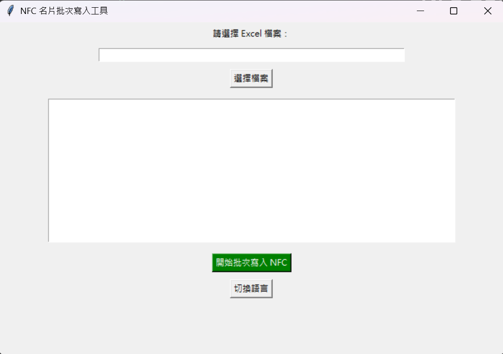

# NFC 名片批次寫入工具(NFC GUI Writer Multilang)



## 安裝指南

1. **安裝 Python 3.10+ for Windows（64-bit）**

   - 下載並安裝 Python 3.10+ 從 [Python 官方網站](https://www.python.org/)。
2. **安裝依賴**

   - 使用以下指令安裝所需的 Python 套件：
     ```bash
     pip install pyinstaller nfcpy openpyxl
     ```

## 執行方式

- 執行以下指令啟動程式：
  ```bash
  python nfc_gui_writer_multilang.py
  ```
